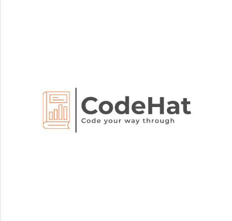
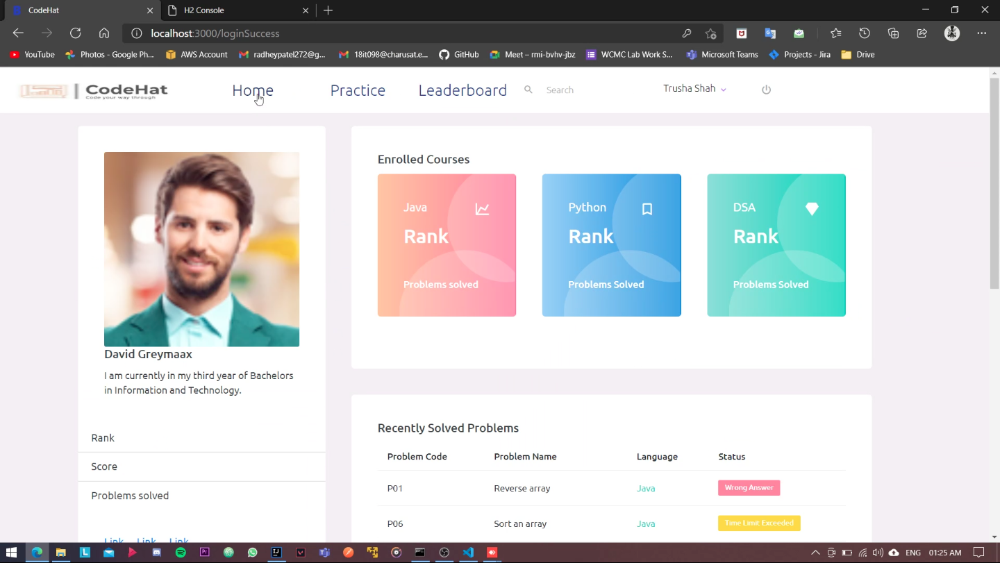
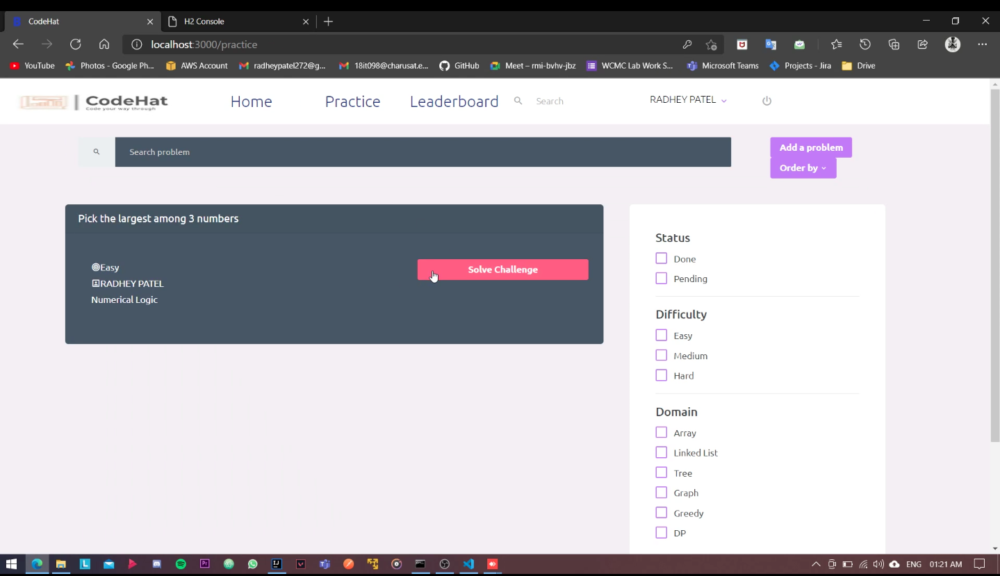
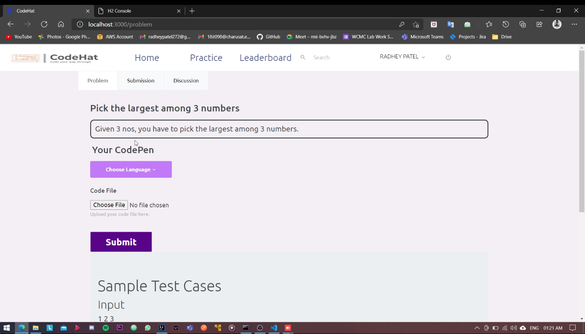
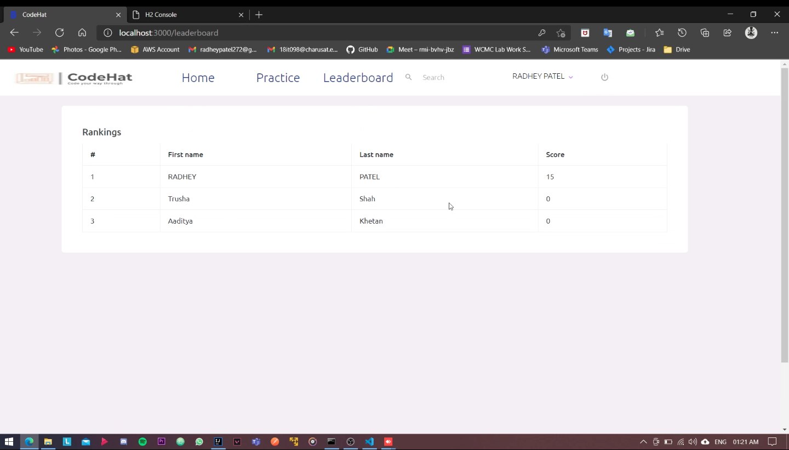
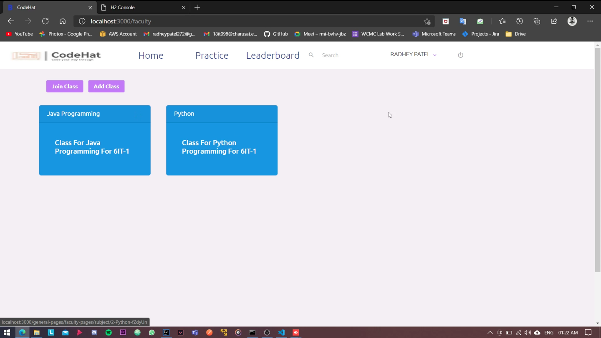
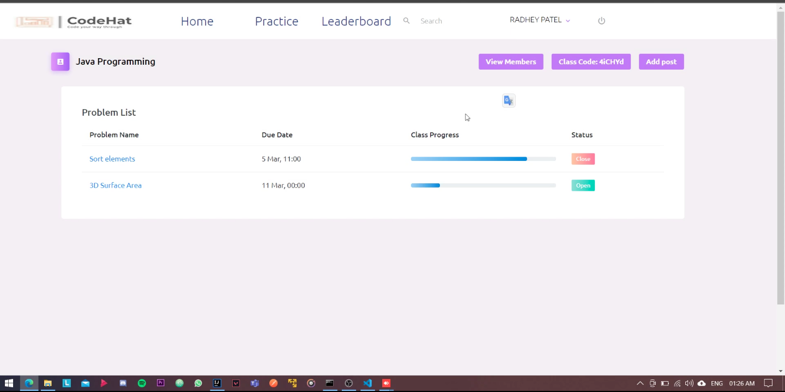
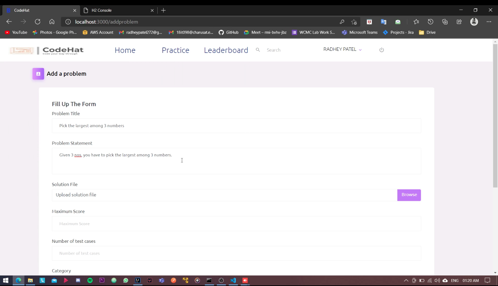
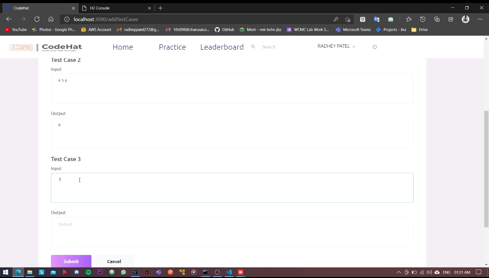
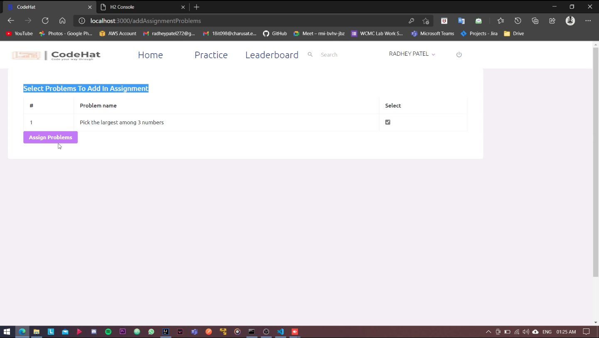

<div id="top"></div>

<!-- PROJECT LOGO -->
<br />
<div align="center">
  <p>
    
  </p>
  <p align="center">
    <br />
  </p>
</div>


<!-- TABLE OF CONTENTS -->
<details>
  <summary>Table of Contents</summary>
  <ol>
    <li>
      <a href="#about-the-project">About The Project</a>
      <ul>
        <li><a href="#built-with">Built With</a></li>
      </ul>
    </li>
    <li>
      <a href="#getting-started">Getting Started</a>
      <ul>
        <li><a href="#prerequisites">Prerequisites</a></li>
        <li><a href="#installation">Installation</a></li>
      </ul>
    </li>
    <li><a href="#problem">Problem statement</a></li>
    <li><a href="#features">Features</a></li>
    <li><a href="#screenshots">Screenshots</a></li>
  </ol>
</details>


<!-- ABOUT THE PROJECT -->
## About The Project

CodeHat is a web application to aid conduct lab sessions for programming subjects. Its a unique combination of platforms like HackerRank and Google classrooms.


<p align="right">(<a href="#top">back to top</a>)</p>


### Built With

The following technologies and tools have been equipped to develop this project -

* [Spring Boot]
* [React.js]
* [AWS RDS - MySQL]
* [JUNIT]

<p align="right">(<a href="#top">back to top</a>)</p>


<!-- GETTING STARTED -->
## Getting Started

To get a local copy up and running follow these simple example steps.

### Prerequisites

* java - jdk 8 and above
* npm 
  ```sh
  npm install npm@latest -g
  ```
* node.js
* MySQL
### Installation


1. Clone the repo. (Combined repository available at - https://github.com/Arthur-272/CodeHat)
2. Install NPM packages
   ```sh
   npm install
   ```
3. Change username and password in application.properties file from the backend repo to connect your MySQL instance.
4. Run npm start command to start the frontend
   ```sh
   npm start
   ```
5. Run the Application.java file to run the backend. (Backend repo - https://github.com/Arthur-272/Autograding)

<p align="right">(<a href="#top">back to top</a>)</p>


<!-- Problem statement -->
## Problem
In recent times, most of the universities and colleges were forced to operate behind closed doors due to corona virus outbreak. Due to this, it was difficult for colleges to conduct practical sessions for programming subjects and keep track of student progress. 
This application can help colleges to move away from traditional system of practical file submission and evaluation and track real time progress of students.


<p align="right">(<a href="#top">back to top</a>)</p>


<!-- ROADMAP -->
## Features

* Carefully curated problems and test cases.
* Supports 5 programming languages.
* Formation of classes/batches by faculty.
* Assign problems and assignments.
* Monitor student progress
* Leaderboard for encouraging competitive learning.


<p align="right">(<a href="#top">back to top</a>)</p>


<!-- CONTRIBUTING -->
## Screenshots
<p>
    <p>
        
    </p>
    <p>
        
    </p>
    <p>
        
    </p>
    <p>
        
    </p>
    <p>
        
    </p>
    <p>
        
    </p>
    <p>
      
  </p>
  <p>
    
  </p>  
  <p>
    
  </p> 
</p>
<p align="right">(<a href="#top">back to top</a>)</p>
